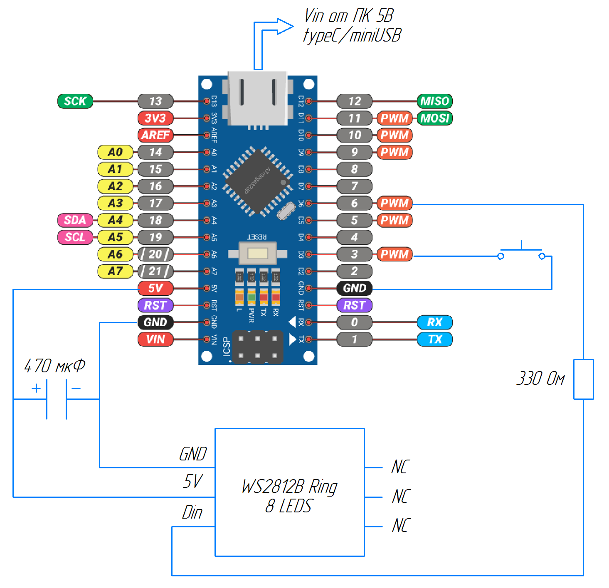
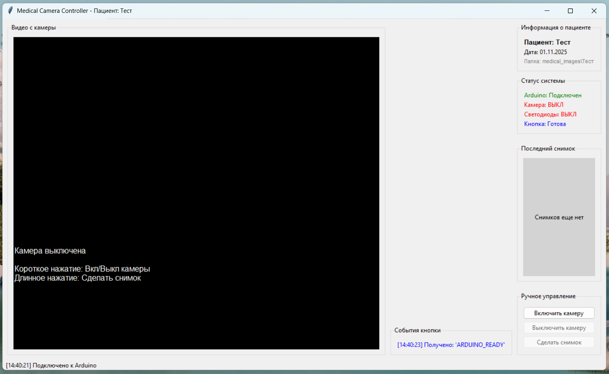

# Многофункциональная интраоральная камера

<div align="center">

🚧 **Версия 1.1 в разработке** 🚧

</div>

## 📋 Подготовка к первому запуску

### Установка необходимого программного обеспечения
- Установить Arduino IDE и необходимые драйверы по гайду https://alexgyver.ru/arduino-first/ (USB-контроллер CH340/CH341)
- Установить одну из версий Python c https://www.python.org/downloads/ (у меня 3.12.5). ❗Отметить галочкой "Add Python to PATH" при установке
- Установить Git (Windows: https://git-scm.com/download/win)
- В командной строке выполнить клонирование репозитория (запускать отдельными командами):
```
# Переход в папку, где будет лежать проект (например, Рабочий стол)
cd Desktop

# Клонирование репозитория
git clone https://github.com/whyclos/multifunctional-intraoral-camera.git

# Переход в папку проекта 
cd multifunctional-intraoral-camera
```
- Установить необходимые библиотеки из `requirements.txt` через командную строку:
```
pip install -r requirements.txt
```
### Подготовка Arduino к работе
- Собрать схему с ардуино на макетной плате:


- Открыть `arduino_camera_and_ring.ino` в Arduino IDE и установить библиотеку `Adafruit_NeoPixel.h` через панель *Инструменты* -> *Управлять библиотеками (Ctrl+Shift+I)*

- Загрузить программу на управляющую плату Arduino назначив в панели *Инструменты* следующие параметры (COM3 для примера):
  
| Параметр | Выбор |
|-----------|-----------|
| Плата  | Arduino Nano |
| Процессор | ATmega328P |
| Порт  | COM3  |

- После загрузки программы закрыть Arduino IDE, чтобы освободить COM-порт для последующего обмена данными

## 🚀 Запуск интраоральной камеры (быстрый старт)
### Подключение и запуск
- Подключить Arduino в сборе с сопутствующими компонентами к USB порту ПК
- Подключить модуль камеры OV5693 к другому USB порту ПК
- Выполнить запуск программного обеспечения интраоральной камеры через командную строку, открытую в папке проекта
```
python main.py
```

### Интерфейс программного обеспечения
При запуске программного обеспечения сначала появится окно, в котором необходимо будет ввести фамилию пациента. Если попытаться пропустить этот этап, приложение закроется. Ввод фамилии, использованной в предыдущих запусках, не ломает программу, что очень радует ✨

После ввода фамилии станет доступно основное окно интерфейса: 


⚠️ На данный момент "ручное управление" через интерфейс ломает работу камеры, поэтому управление осуществляем через кнопку со следующей логикой:

| Действие | Результат | Индикация |
|----------|-----------|-----------|
| Короткое нажатие | Камера: ВКЛ/ВЫКЛ | Светодиоды: ВКЛ/ВЫКЛ |
| Длинное нажатие | Сделать снимок | Превью в интерфейсе |

Длинным считается нажатие длительностью более 1 сек.

По результатам работы программы и обработки длинных нажатий в папке проекта создается папка `medical images`, внутри которой действует следующая структура:
```
medical_images/              # Создается автоматически
├── Иванов/                 # Папка пациента
│   ├── Иванов_2024-01-15_10-30-25.jpg
│   └── Иванов_2024-01-15_10-31-10.jpg
└── Петров/
    └── Петров_2024-01-15_11-15-30.jpg
```

## 🛠️ Текущие проблемы и задачи

| Область | Задача | Приоритет | Срок | Статус |
|---------|--------|:---------:|:----:|:------:|
| **🎯 ВЕРСИЯ 1.1** | | | | |
| **⚡ Производительность** | Регистрация спектров диффузного отражения | 🚨 HIGH | v1.1 | 🔴 |
| **🐛 Баги** | Починить управление через интерфейс | ⚠️ MEDIUM | v1.1 | 🟡 |
| **🔧 Аппаратное** | Корпус макета | ⚠️ MEDIUM  | v1.1 | 🟡 |
| **📚 Документация** | Подготовить документацию версии 1.1 | ⚠️ MEDIUM | v1.1 | 🟡 |
| **🎯 ВЕРСИЯ 1.2** | | | | |
| **⚡ Производительность** | Обработка спектров методами машинного обучения| 🚨 HIGH | v1.2 | 🔵 |
| **⚡ Производительность** | Ускорить запуск камеры | 🚨 HIGH | v1.2 | 🔵 |
| **🔧 Аппаратное** | Свое диодное кольцо | 🚨 HIGH | v1.2 | 🔵 |
| **🔧 Аппаратное** | Уменьшение количества проводов | ⚠️ MEDIUM| v1.2 | 🔵 |
| **🎨 Интерфейс** | Смена пациента без перезапуска | 💡 LOW  | v1.2 | 🔵 |
| **📚 Документация** | Подготовить документацию версии 1.2 | ⚠️ MEDIUM | v1.2 | 🔵 |
| **🎯 ВЕРСИЯ 1.3** | | | | |
| **⚡ Производительность** | Обработка спектров нейросетевыми методами | 🚨 HIGH | v1.3 | 🔵 |
| **🎨 Интерфейс** | Улучшение вида интерфейса | 💡 LOW | v1.3 | 🔵 |
| **📚 Документация** | Подготовить документацию версии 1.3 | ⚠️ MEDIUM | v1.3 | 🔵 |

### 📊 Легенда
**Статус:**
- 🔴 **В работе** - активно разрабатывается
- 🟡 **В планах** - запланировано на отчетный период  
- 🟢 **Завершено** - готово и протестировано
- 🔵 **Отложено** - не планируется в текущей версии

**Приоритет:**
- 🚨 **HIGH** - критически важно, блокирует работу
- ⚠️ **MEDIUM** - важно, но не блокирует
- 💡 **LOW** - улучшение, можно отложить

## 👥 Как сюда коммитить?
**🔄 Начало работы (каждый сеанс)**
```
# Перейти в основную ветку
git checkout main

# Скачать последние изменения
git pull origin main
```

**🌿 Создать ветку для внедрения изменений**
```
# Создать новую ветку для задачи
git checkout -b feature/добавить-смену-пациента

# Или более короткие названия:
git checkout -b fix/баг-камеры
git checkout -b docs/обновление-инструкций
git checkout -b style/форматирование-кода
```

**💻 Работа в ветке**
```
# Проверить в какой ветке находишься
git branch

# Работа с файлами, внесение изменений
# Сохранение файлов в редакторе (Visual Studio Code, PyCharm, ...)
```

**💾 Сохранение изменений**
```
# Посмотреть, что изменилось
git status

# Добавить все измененные файлы в коммит
git add .

# Или конкретные измененные файлы
git add main.py
git add README.md

# Создать коммит с понятным описанием
git commit -m "your short text here"
```

**🚀 Отправка изменений на github**
```
# Отправить ветку на GitHub (первый раз)
git push -u origin feature/название-ветки

# В последующие разы (новые коммиты в той же ветке)
git push
```

**🌐 Создание pull-request (для добавления изменений в main ветку)**
- После git push зайти на GitHub, открыть репозиторий → вкладка "Pull Requests"
- "New pull request"
- Выбор ветки: base: main (куда мержим), compare: твоя-ветка (что мержим)
- Заполнить информацию в Title и Description
- "Create pull request"

**📖 Полезные команды** 

- Посмотреть все ветки
```
git branch
```
- Посмотреть историю коммитов
```
git log --oneline
```
- Переключиться между ветками
```
git checkout main
git checkout имя-ветки
```
- Удалить локальную ветку (после мержа)
```
git branch -d имя-ветки
```
- Удалить ветку на GitHub
```
git push origin --delete имя-ветки
```
**🎯 Короткая шпаргалка**
- Начать работу:
```
git pull origin main
git checkout -b feature/моя-фича
```
- Закончить работу:
```
git add .
git commit -m "Описание"
git push -u origin feature/моя-фича
# → СОЗДАТЬ PULL REQUEST на GitHub
```
